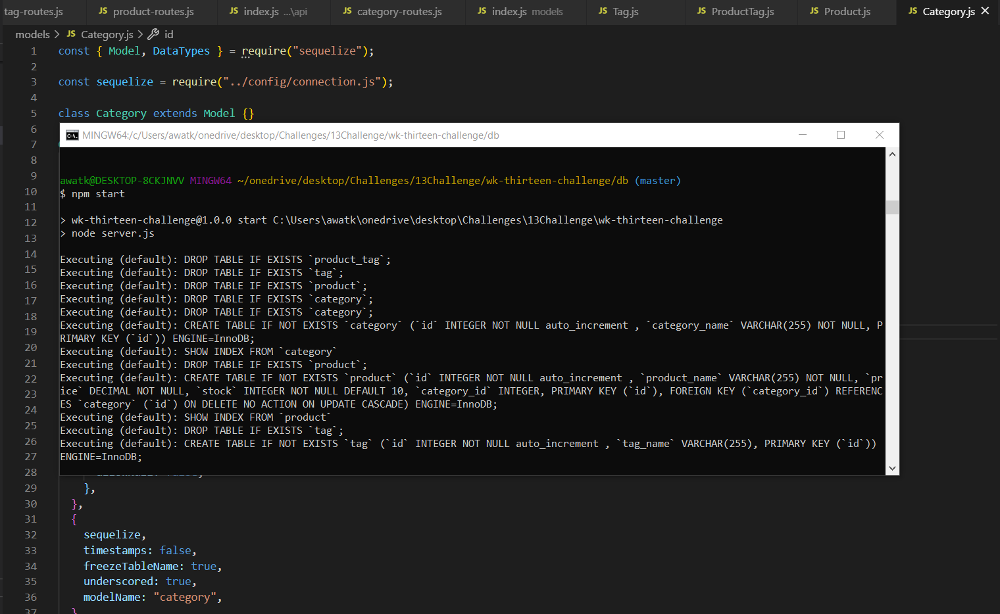

# **E-Commerce Website**

## **Description**

This website utilizes Sequelize to provide information that is organized in different ways that the user can determine. The tables are relational and they have a many-to-many type of relationship.

## **Table of Contents**

- [Installation](#Installation)

- [Usage](#Usage)

- [Contributions](#Contributions)

- [Testing](#Testing)

- [Questions](#Questions)

## **Installation**

To install this project please download the GitHub repo and run npm i to install the necessary packages to run through the api endpoints using Insomnia Core.

## **Usage**

This project is meant to be used to display data that is relational to each other. The user can choose the proper endpoints which will then display data accordingly.
- Here is a video showing the functionality of the website! [E-Commerce Website](https://drive.google.com/file/d/1Xw5QXE8MLKYlIWT1zxounDt2aMcX876Z/view)

## **Contributions**

There are many ways in which you can contribute to this project, for example:

- Submit bugs and feature requests
- Review any code changes
- Review documentation for any other errors

## **Testing**

One could test the project by installing a downloading the neecssary packages and then try the different endpoints in Insomnia Core.

## **Questions**

If you have any questions in regard to this project please reach out by contacting me through:

- My email: allielynne20@gmail.com
- My GitHub username: [allielynne20](https://github.com/allielynne20)

**Thank you!** :upside_down_face:

_Licensed under the ISC._
